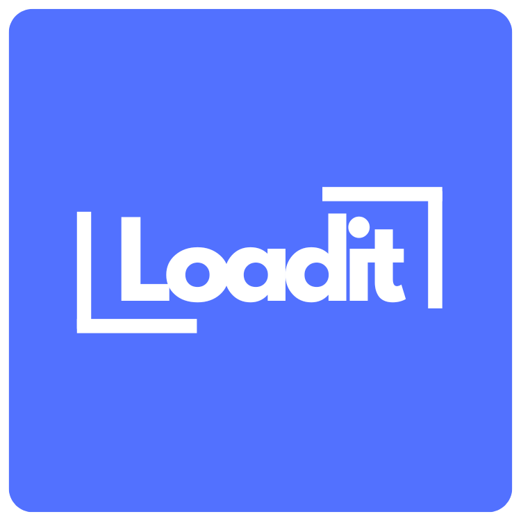

# 🚚 Load It – Smart Logistics Platform

## 🌟 Overview & Achievements

**Load It** is my dream project—a smart, on-demand logistics platform inspired by Swiggy/Zomato, but built for goods transportation. The project was recognized as one of the **Top 15 Projects across the entire department** and awarded **Best Project at my college**, marking a major milestone in my academic journey.

---

## 🎨 Logo & Slogan

📸 **Screenshot Placeholder:**

The project features a **custom hand-crafted logo** designed specifically for Load It.

**Slogan:**

> **Book It. Load It. Ship It.**

This represents the simplicity and efficiency of the platform—from booking to delivery.

---

## 🏠 Homepage

📸 **Screenshot Placeholder:**

 
* Interactive and modern UI design
* Clean layout with smooth navigation
* Highlights core features such as booking, tracking, and reliability
* Designed to provide an engaging first impression for users

---

## 📦 Booking Page

📸 **Screenshot Placeholder:**

The booking module allows users to enter detailed shipment information, including:

* Sender name and phone number
* Receiver name and phone number
* Pickup and delivery address
* Load type and weight (in tons)
* Preferred driver (optional)

This ensures accurate load matching and smooth coordination.

💳**Advance Payment (Razorpay Integration)**

* Supports advance payment during booking to confirm orders
* Integrated with Razorpay for secure and fast online transactions
* Helps reduce last-minute cancellations and ensures commitment from users
* Payment status is linked with booking and load approval workflow

---

## 👥 User Roles & Dashboards

The platform supports **three major user roles**, each with a dedicated login, signup, and dashboard:

### 🚛 Driver Dashboard

📸 **Screenshot Placeholder:**

* View active loads
* Live location tracking
* Order history
* Earnings overview

### 🏢 Owner Dashboard

 
* Manage available trucks
* View assigned and completed loads
* Track income and saved operational costs

### 🙋 User Dashboard

 

* Book new loads
* Track shipments in real time
* View order history
* Monitor cost savings

---

## 🛠️ Admin Dashboard

 
 

The Admin panel provides full system control:

* Manage users, drivers, and owners
* Review and approve driver and owner registrations
* Verify uploaded documents
* Approve or reject load requests
* Monitor platform activity in real time

---

## 🗄️ Database & Technology

* Designed to handle **multiple user roles and relationships**
* Currently implemented using **PHP and HTML**
* Structured database supporting users, drivers, owners, and loads

### 🔄 Ongoing & Future Enhancements

* Converting the system into a **fully dynamic and production-ready platform**
* Hosting the web application
* Developing a **mobile app using Android Studio**
* Implementing **real-time GPS tracking** using **Firebase**
* Integrating **Leaflet maps** for live tracking using completely **free and open-source tools**

---

## 🚀 Vision

Load It aims to become a **scalable, asset-light, and reliable logistics solution** that simplifies goods transportation for businesses and individuals alike—making logistics smarter, transparent, and accessible.

---

⭐ *If you like this project, feel free to star the repository and follow the journey!*
